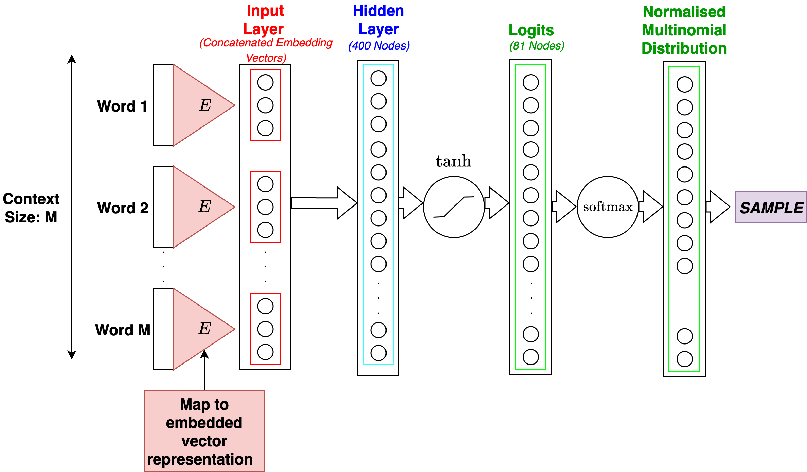
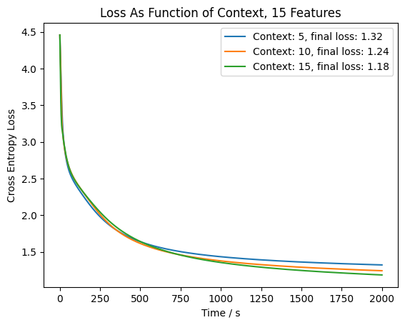
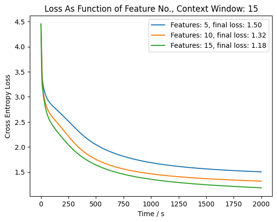

# Shakespeare Maker!

## Introduction
This project builds upon work by [Andrej Karpathy](https://github.com/karpathy/makemore) and [Bengio et al. (2003)](https://www.jmlr.org/papers/volume3/bengio03a/bengio03a.pdf) [^1]. In this project, we train models on the first $10000$ lines of a .txt file containing [the collected works of Shakespeare](https://gist.github.com/blakesanie/dde3a2b7e698f52f389532b4b52bc254#file-shakespeare-txt). The two models we use are $N$-grams of varying context window length (i.e. different values of $N$), and a simple multi-layer perceptron (MLP) model, similar to the one prescribed by Bengio et al. (referenced above). We then inspect the performance of the model by getting it to generate some lines of "pseudo-Shakespeare"; the models' efforts can be found in the "./generated-text-{embedding, ngram}" directories for models with different parameters. The architecture of these models is explained below.

## N-Gram Models
The $N$-gram models are relatively simple, and tokenization occurs at the character-level. We start by generating a vocabulary from the .txt file containing Shakespeare's work, being careful to add space ("+") and line break ("£") characters to insure that the model can handle these types of characters when generating its own text. In general, we observe (predictably) that the model can generally generate more coherent text when the size of the model's context window (the "$N$" in "$N$-gram") is increased. However, this contributes to an increase in computation time, as per the curse of dimensionality, wherein, for a vocabulary of size $V$ and context window of size $N$, the size of the matrix encoding the probability of a given character following the characters ealier in the window scales as $V^N$, which quickly becomes problematic as the context window increases in size.

Compare the following text, generated by a $3$-gram: 

>Wells the themay mustes.

to some text generated by a $5$-gram:
> My honourable Antony of

which are the first lines of text generated by each model. We can see that the $3$-gram easily recovers short, frequent words such as the definite article, "the", but quickly loses coherence; words longer than $3$ characters may loosely approximate real words (e.g. "Wells" isn't that far from "Well"; but "Wells" doesn't appear in the dataset). The model suffers because there is no robust way for the model to learn the similarities between letters and their own capital form other than hoping that common $N$-grams often appear next to each other in capital form. For example, "The" and "the". Therefore, we might hope that a vector embedding model, which can learn a mapping between these characters and some high-dimensional embedding space, performs better and recovers something closer to "real" English.

## Vector Embedding Models
Introducing some form of embedding is ubiquitious in modern natural language processing [^2]. In this project, I tried three different sizes for the embedding space: $[5, 10, 15]$, and context windows of size $[5, 10, 15]$ for each. It may seem like an unfair advantage over their $N$-gram cousins to give my embedding models comparatively larger context windows, but this is the entire point: it doesn't take too much time to implement, compared to a, for example, $15$-gram, which exceeds the limitations of my weak M3 Mac.

<figure>

<figcaption>Structure of MLP model.</figcaption>
</figure>

These models are two-layer MLP models, where the input layer has dimensions $\text{Context Size}\times \text{Feature Number}$, and the first hidden layer has $400$ nodes, with $\text{tanh}$ activation. The output layer obviously has dimensions equal to $V$, i.e. the size of the vocabulary, and we apply softmaxing to this output layer, producing a probability distribution over the vocabulary, from which we sample the next character. Originally, I applied a $\text{tanh}$ nonlinearity to the logits, but this severely reduces the ability of the model to make confident predictions, and so loss is very high even at large epoch numbers. Therefore, this nonlinearity was removed. 

Training was performed over 2000 epochs.

Take a look at some of the text generated by a model with a feature number (embedding vector dimension) of $15$ and a context window of size $15$-

> POMPEY. That o' th' Meive thy poster set up times of this pareful torms him?
> ...
> ANTONY. Mine of theuved, reasons betwas the time him, know deservances form from Marcanor finis handvee the englow boin love,

We can see that the model is starting to understand that capital letters should appear at the start of sentences, and that lines often begin with character names in ALL CAPS, followed by '.' symbols (which is exactly how things appear in the original data set). We can also see that the model has a better understanding of punctuation (appearing at the ends of clauses) and can recover larger words- such as "reason". However, the model is largely still incoherent. This is because we have one fixed embedded representation for each of the characters in the vocabulary; in the absence of a transformer, there is no real way to give the model flexibility to understand the difference between identical characters in different contexts (i.e. the capital M in "Mark" is because it's a proper name, wherease we would only capitalize "More" if it's at the beginning of a sentence- we can't just have capital "M"s on everything which begins with an "M"). This is where attention and transformers come in to give us additional expressivity.

Here is a sample generated by a model with embedding dimension $10$ and context window $5$:
>We might that a kne speer his Giv'd in there
>...
>And then his true times my thou shall be well him. Caesar, have done; let this grounds.

The model is recovering some important "Shakespearean" attributes (the name "Caesar", the word "thou") but hasn't yet figured out that we can also use capitals to encode names of speakers at the beginning of each line.

What is strange qualitatively about these models is that, in some sense, the vector embeddings seem to make *less* sense from an English-language point of view than some of the outputs from the $5$-gram model, though the vector embedding models definitely seem to have more of a "clue" about overall structure of the Shakespearean verse than the $N$-gram models.

## Performance and Conclusions
It is telling that all of the models display some ability to understand that capital letters often appear after line breaks (though there are many exceptions in the dataset). None of the models even come close to coherence or grammatical fluency. 

We can see that we seem to get more for our money by increasing the number of features for a given context window rather than the size of the context window for a given number of features:

<figure>

<figcaption>Loss as a function of context size for fixed feature number (15 features).</figcaption>
</figure>

<figure>

<figcaption>Loss as a function of feature number for fixed context window length (15 characters).</figcaption>
</figure>

i.e. increasing the number of features while maintaining a fixed context window results in a far more dramatic drop in the final loss reported during training. However, there is a cost associated with increasing the number of features; this increases the number of nodes in the input layer (recall that the dimensions of the input layer are equal to $\text{Context Size}\times \text{Feature No.}$), and we also know that backpropagation should scale with complexity $\sim O(\text{Nodes})$ as the number of nodes in a neural network increases.

[^1]: Bengio, Y., Ducharme, R., Vincent, P., Jauvin, C., Ca, J. U., Kandola, J., Hofmann, T., Poggio, T., & Shawe-Taylor, J. (2003). A Neural Probabilistic Language Model. In Journal of Machine Learning Research (Vol. 3).

[^2]: See multiple sources: Jurafsky, D., & Martin, J. H. (n.d.). Speech and Language Processing An Introduction to Natural Language Processing, Computational Linguistics, and Speech Recognition with Language Model (Third Edition); 3Blue1Brown's (Grant Sanderson's) [excellent YouTube videos on transformers](https://www.youtube.com/watch?v=wjZofJX0v4M&pp=0gcJCfwAo7VqN5tD); Bengio's paper [^1], and anything about modern production LLMs [such as ChatGPT](https://openai.com/index/new-embedding-models-and-api-updates/).